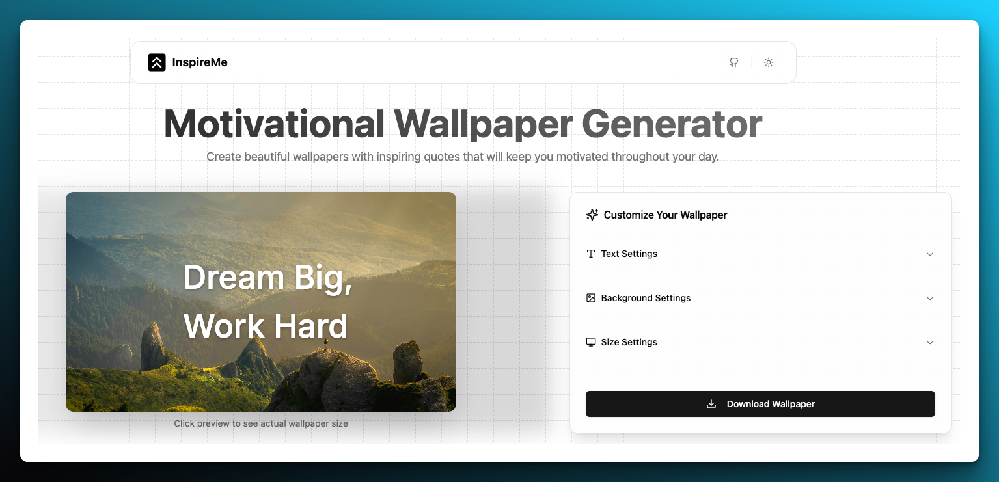

# Inspire Me - Motivational Wallpaper Generator

<p align="center">
  
</p>

A modern, open-source wallpaper generator that creates beautiful motivational wallpapers with customizable quotes, fonts, and backgrounds. Built with Next.js 14, React, Tailwind CSS, and Tauri.

## ✨ Features

- 🖼️ Create custom wallpapers with inspiring quotes
- 🎨 Multiple background options (images, solid colors, gradients)
- 🔤 Customizable fonts, sizes, and text effects
- 📱 Responsive design with custom size presets
- 🎯 Precise text positioning control
- 🖌️ Gradient text support
- 🌓 Dark mode support
- 📥 High-quality PNG export

## 🚀 Getting Started

### Prerequisites

- Node.js 18+ 
- bun
- Rust toolchain (for Tauri)
  - [Install Rust](https://www.rust-lang.org/tools/install)
  - Additional OS-specific dependencies for Tauri: [System Dependencies](https://v2.tauri.app/start/prerequisites/)

### Installation

1. Clone the repository
2. Run `bun install` to install the dependencies
3. Run `bun dev` to start the web development server

## 📦 Building Desktop App

### Development

To run the desktop app in development mode:
```bash
bun tauri:dev
```

### Building Desktop App

To create distributable packages for the desktop app:
```bash
bun tauri:build
```

This will create platform-specific distributables in the `src-tauri/target/release/bundle` directory:
- Windows: `.msi` installer and `.exe`
- macOS: `.dmg` file and `.app`
- Linux: `.AppImage`, `.deb`, and other formats

#### Building Notes

- Make sure you have the required OS-specific dependencies installed for Tauri
- For cross-platform builds, refer to the [Tauri documentation](https://tauri.app/v1/guides/building/)
- Build configurations can be customized in `src-tauri/tauri.conf.json`